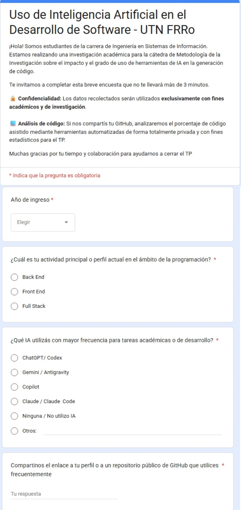
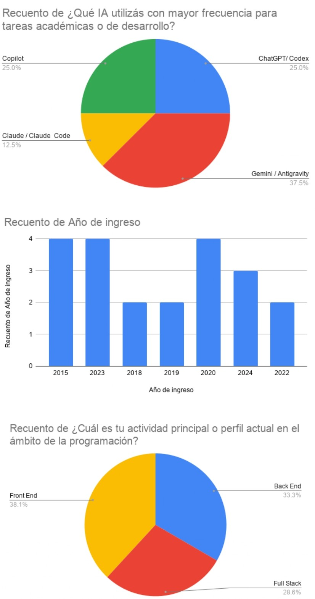
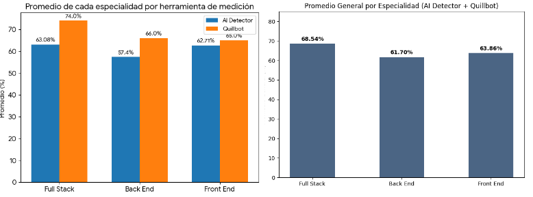
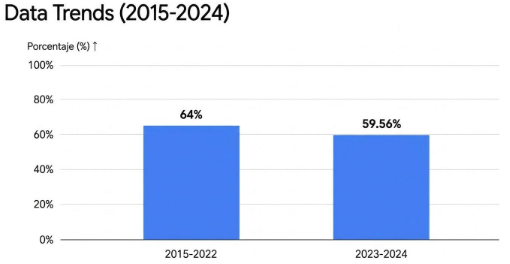

# Trabajo Práctico - Metodología de la Investigación

**Facultad Regional Rosario** **Universidad Tecnológica Nacional (UTN)** **Año de cursado:** 2026 | **Corte:** 1er cuatrimestre

### Alumnos
| Alumnos | Legajo | N° de teléfono | Email |
| :--- | :--- | :--- | :--- |
| Banqueri Federico | 47834 | 3413661783 | federicobanqueri@hotmail.com |
| Furrer Francisco | 47853 | 3415665475 | franciscofurrer@gmail.com |
| Piovella, Agustin | 45988 | 3416749144 | agustinpiovella@gmail.com |
| Zapata, Mayra | 42969 | 3476587043 | mayrazapatautn@gmail.com |

**Docentes:** Mario Castagnino - Yanina Nalli

---

## Índice

* Planteamiento del Problema
* Selección del Tema
* Justificación
* Pregunta de Investigación
* Definiciones y operacionalización de variables
* Variables en estudio
* Definición de las variables
* Clasificación (independiente o dependiente)
* Clasificación según su naturaleza (Cuantitativa o cualitativa)
* Definición conceptual
* Definición Operacional
* Indicadores
* Instrumentación
* Hipótesis
* Unidad de análisis, población, y muestreo
* Unidad de Análisis
* Población
* Muestreo
* Diseño de Investigación
* Definición del Alcance
* Elección del Diseño
* Diseño del Instrumento
* Distribución y Convocatoria
* Extracción de Repositorios
* Auditoría y Clasificación
* Herramienta de uso interno
* Flujo de Trabajo Técnico (Workflow)
* Plan de Análisis de Datos
* Análisis Descriptivo Univariado
* Análisis Bivariado (Interrelación de Variables)
* Trabajo de campo y análisis de resultados
* Formulario difundido entre los estudiantes
* Resultados del formulario
* Resultados del análisis de código
* Síntesis final
* Bibliografía

---

## Planteamiento del Problema

### Selección del Tema
El uso de la IA en estudiantes de ISI UTN FRRo, en un determinado periodo de tiempo.

### Justificación
El avance reciente y la creciente adopción de herramientas de Inteligencia Artificial (IA), especialmente desde su masificación a partir de 2023, han generado transformaciones significativas en las dinámicas de aprendizaje de los estudiantes y en la manera en que abordan la resolución de problemas académicos.

### Pregunta de Investigación
¿Qué relación existe entre la actividad principal de desarrollo, el año de ingreso a la carrera y el grado de uso de herramientas de Inteligencia Artificial en estudiantes de Ingeniería en Sistemas de Información de la Facultad Regional Rosario?

### Objetivos
Analizar la relación existente entre el año de ingreso de los estudiantes de Ingeniería en Sistemas de Información y su grado de uso de herramientas de Inteligencia Artificial en actividades académicas y técnicas.

---

## Definiciones y operacionalización de variables

### Variables en estudio
* Tipo IA.
* Actividad Principal.
* Año de ingreso.
* Grado de uso de la IA.

### Definición de las variables
* **Tipo IA:** ChatGPT, Gemini, Copilot, Claude, NotebookLM, Perplexity AI.
* **Actividad Principal:** Back End, Front End, Full Stack.
* **Año de ingreso:** 2015, 2016, 2017, 2018, 2019, 2020, 2021, 2022, 2023, 2024, 2025.
* **Grado de uso de la IA:** Alta, Media, Baja.

### Clasificación (independiente o dependiente)
* **Tipo IA:** Independiente.
* **Actividad Principal:** Independiente.
* **Año de ingreso:** Independiente.
* **Grado de uso de la IA:** Dependiente.

### Clasificación según su naturaleza (Cuantitativa o cualitativa)
* **Tipo IA:** Cualitativa.
* **Actividad Principal:** Cualitativa.
* **Año de ingreso:** Cuantitativa.
* **Grado de uso de la IA:** Cualitativa.

### Establecer su nivel de medición (Nominal, Ordinal, Intervalo o Razón)
* **Tipo IA:** Nominal.
* **Actividad Principal:** Nominal.
* **Año de ingreso:** Intervalo.

---

## Operacionalización

### Definición conceptual
* **Tipo IA:** Refiere al tipo de Inteligencia Artificial utilizada por los alumnos en la presente investigación.
* **Actividad Principal:** Se refiere a la actividad principal a la cual se dedican los alumnos dentro de la programación.
* **Año de ingreso:** Hace referencia al año en que el estudiante ingresó a la carrera de Ingeniería en Sistemas de Información en la UTN FRRo, dentro del período comprendido entre 2015 y 2025.
* **Grado de uso de la IA:** Refiere al nivel de uso de herramientas de inteligencia artificial para la generación de código por parte de los alumnos.

### Definición Operacional
*Cómo va a observar (medir) esa variable en la práctica, cómo lo va a hacer, cuándo y dónde.*

* **Tipo IA:** Se medirá a través de un formulario online en la que los estudiantes Indicarán qué herramienta de inteligencia artificial utilizan con mayor frecuencia, para tareas académicas.
* **Actividad Principal:** Se medirá, mediante el formulario, dentro del mismo contaremos con las diversas áreas que son de nuestro interés saber, en él los alumnos seleccionarán una o varias opciones.
* **Año de ingreso:** Se medirá a través del formulario, antes mencionado, en él, contaremos con el periodo comprendido de 10 años para que los alumnos, seleccionen su año de ingreso a la UTN FRRo.
* **Grado de uso de la IA:** En el formulario, le pediremos a los alumnos que nos pasen sus repositorios de Github. De esa forma, analizaremos el código de sus proyectos públicos con la herramienta interna y Quillbot que nos ayudará a detectar qué porcentaje de código está hecho con inteligencia artificial, más una posterior revisión manual nuestra. Luego, la clasificación de alto, medio o bajo se decidirá consultando con docentes de las cátedras desarrollo de software y bases de datos de la UTN FRRo.

### Indicadores
*Dato de la realidad que permiten valorizar la variable. Son "señales" específicas o datos concretos de la realidad que permiten saber si la variable está presente y en qué medida.*

* **Tipo IA:** Herramienta IA, seleccionada por cada estudiante en el formulario: ChatGPT, Gemini, Copilot, Claude, NotebookLM, Perplexity AI.
* **Actividad Principal:** Área de programación elegida por los estudiantes en el formulario.
* **Año de ingreso:** El año calendario declarado (valor numérico) entre 2015 y 2025 que el alumno reporta en la encuesta.
* **Grado de uso de la IA:** Porcentaje determinado por el criterio de los docentes de desarrollo de software y bases de datos:
  * Alto (+ 70% del código generado con ia)
  * Medio (entre 40 y 70% del código generado con ia)
  * Bajo (menor al 40% del código generado con ia)
* **Frecuencia de uso de herramientas de IA:** estimada mediante QuillBot, la herramienta interna y la revisión manual de los repositorios.

### Instrumentación
*Herramienta específica que se va a utilizar para recolectar los datos.*

* **Tipo IA:** Formulario Virtual de preguntas cerradas y de opción múltiple.
* **Actividad Principal:** Formulario Virtual de preguntas cerradas y de opción múltiple.
* **Año de ingreso:** Formulario Virtual de preguntas cerradas.
* **Herramienta:** "Herramienta interna" "Quillbot" y con una revisión con nuestra herramienta interna de sus proyectos de github, sumado a los que indiquen los estudiantes en el formulario.

---

## Hipótesis
Los estudiantes cuya actividad principal es el desarrollo frontend y que ingresaron a la carrera en 2023 o posteriormente presentan un mayor grado de uso de herramientas de inteligencia artificial en comparación con aquellos dedicados al desarrollo backend, con quienes no se dedican al desarrollo y con los estudiantes que ingresaron antes de 2023.

---

## Unidad de análisis, población, y muestreo

### Unidad de Análisis
Los estudiantes de la carrera Ingeniería en Sistemas de Información (ISI) de la Universidad Tecnológica Nacional, Facultad Regional Rosario (UTN FRRo), que utilicen herramientas de inteligencia artificial para la realización de tareas académicas o actividades relacionadas con sus áreas de desarrollo, tales como Backend, Frontend o Full Stack.

### Población
La población está conformada por todos los estudiantes de la carrera Ingeniería en Sistemas de Información de la Universidad Tecnológica Nacional, Facultad Regional Rosario (UTN FRRo), cuyo año de ingreso se encuentre comprendido entre 2015 y 2025.

### Muestreo
Nuestro trabajo se enmarca dentro de un muestreo no probabilístico por conveniencia, ya que la selección de los participantes dependerá de la accesibilidad y disposición de los estudiantes para responder el formulario y compartir posteriormente sus repositorios de GitHub para su análisis.

---

## Diseño de Investigación

### Definición del Alcance
El alcance de esta investigación es de carácter correlacional. De acuerdo con el estado actual del conocimiento, si bien existen abundantes descripciones aisladas sobre el uso de software basado en Inteligencia Artificial y perfiles de desarrollo, este estudio busca analizar la relación y el grado de asociación estadística entre las variables independientes (Actividad Principal y Año de ingreso) y la variable dependiente (Grado de uso de la IA para la generación de código) en los estudiantes de Ingeniería en Sistemas de Información. No se limita a describir frecuencias, sino que pone a prueba una relación de covariación explícita formulada en la hipótesis de trabajo.

### Elección del Diseño
Se ha seleccionado un Diseño Observacional Transversal.

#### Justificación
El equipo de investigación recolectará los datos en un único momento del tiempo sin realizar ninguna manipulación intencional de las variables independientes. Se analizará el fenómeno en su estado natural. Dado que las variables independientes planteadas en nuestro estudio (Año de ingreso y Actividad Principal) constituyen atributos preexistentes en los sujetos de análisis, no es técnicamente factible su manipulación experimental o asignación aleatoria por parte del investigador. Por lo tanto, se descarta la aplicación de diseños experimentales, pre experimentales o cuasiexperimentales.

#### Simbología
El diseño se representa bajo la siguiente estructura observacional en un solo corte temporal:
`O1 O2 O3`

Donde:
* **O1:** Recolección de datos mediante encuestas estructuradas.
* **O2:** Análisis de repositorios de código fuente mediante herramientas externas de detección.
* **O3:** Análisis complementario de repositorios utilizando una aplicación interna desarrollada por el equipo de investigación.

---

## Procedimiento, Técnicas e Instrumentos
Para llevar a cabo la recolección de los datos de forma metódica, se seguirá la siguiente secuencia de pasos lógicos:

### Diseño del Instrumento
Se estructurará un formulario virtual mixto que integrará preguntas cerradas de opción múltiple y un campo de validación técnica.

### Distribución y Convocatoria
Se difundirá el formulario online a los estudiantes de la carrera comprendidos en la población objetivo (ingresantes 2015-2025) de la UTN FRRo.

### Extracción de Repositorios
A partir de los enlaces de GitHub provistos voluntariamente por los participantes, se aplicarán las herramientas automatizadas Quillbot y la herramienta interna para analizar los proyectos públicos, además luego de realizado ese análisis, utilizamos una herramienta de uso interno.

### Auditoría y Clasificación
El grupo de investigación realizará una revisión manual del código analizado. Posteriormente, se procesarán los porcentajes obtenidos contrastándolos con los criterios convalidados por los docentes de las cátedras de Desarrollo de Software y Bases de Datos de la facultad para establecer el nivel definitivo.

---

## Herramienta de uso interno
Es un Detector de Inteligencia Artificial para Repositorios de GitHub. Técnicamente, se define como una herramienta de análisis estático y forense de código fuente que opera bajo una arquitectura 100% local (On-Premise).

### Flujo de Trabajo Técnico (Workflow)
El ciclo de vida del análisis de un repositorio consta de 6 etapas secuenciales automatizadas desde la interfaz:

1. **Ingesta y Clonación Temporal:** El usuario introduce la URL de GitHub en la UI. El módulo `cloner.py` (`clone_repository`) parsea la URL (detectando ramas/subcarpetas) y descarga de forma asíncrona el repositorio en el directorio temporal del sistema operativo (`AppData/Local/Temp`).
2. **Filtrado y Análisis Estático Inicial:** El módulo `file_scanner.py` (`scan_repository_files`) realiza una limpieza y preselección de archivos:
   * Exclusión: Descarta carpetas pesadas o irrelevantes (ej. `node_modules`, `venv`, `.git`) configuradas en `constants.py`.
   * Inclusión: Filtra por extensiones de código permitidas (`.py`, `.js`, `.cpp`, etc.).
   * Heurística: Busca patrones de comentarios o artefactos típicos de Markdown residual que suelen dejar las IA generativas.
3. **Auditoría Forense con LLM:** Para cada archivo que supera el filtro, el módulo `ai_detector.py` (`analyze_code_snippet`) interactúa con la API de Ollama:
   * Se envía el bloque de código dentro de un prompt estructurado para auditoría forense.
   * El modelo `qwen2.5-coder:1.5b` evalúa la estructura del código y devuelve una respuesta en formato JSON con una probabilidad de autoría de IA (escala de 0 a 100).
   * Se aplica un algoritmo de amplificación de confianza al score recibido.
4. **Consolidación y Cálculo Ponderado:** Una vez analizados los archivos individualmente, `app.py` (`calculate_final_score`) calcula un promedio ponderado. Esto significa que el nivel de sospecha de los archivos más grandes (con más líneas de código) tiene un mayor impacto en la métrica global que los archivos pequeños.
5. **Presentación de Resultados y Métricas:** La UI procesa los datos y categoriza el repositorio bajo tres umbrales de sospecha (Bajo < 40% < Medio < 70% < Alto). Muestra al usuario:
   * Un veredicto general cualitativo.
   * Una barra de progreso visual premium.
   * Una tabla detallada con el desglose de score por cada archivo individual.
6. **Purga del Entorno (Teardown):** Ya sea por finalización exitosa del proceso o por la captura de una excepción (error), el sistema invoca de forma obligatoria a `clean_temporary_dir` en `cloner.py` para eliminar los archivos clonados en el directorio temporal, garantizando la eficiencia en el almacenamiento local.

---

## Plan de Análisis de Datos
Para procesar la información recolectada y evaluar el comportamiento de las variables junto con la validez de la hipótesis formulada, se aplicarán las siguientes herramientas estadísticas y gráficas:

### Análisis Descriptivo Univariado
Para las variables cualitativas nominales (Tipo de IA y Actividad Principal) y la variable cualitativa ordinal (Grado de uso de la IA), se construirán tablas de distribución de frecuencias relativas (porcentajes) y absolutas. Se representarán visualmente a través de gráficos de barras y gráficos de tortas.

### Análisis Bivariado (Interrelación de Variables)
A fin de contrastar empíricamente la hipótesis (la cual vincula el perfil Front End y los ingresos recientes con un nivel de uso de IA más alto), se utilizarán tablas de contingencia cruzadas (tablas de doble entrada) que interrelacionen Actividad Principal y Año de ingreso (estratificado en antes/después de 2023) frente a la variable dependiente Grado de Uso. Estas correlaciones se representarán visualmente mediante gráficos de barras agrupadas o compuestas, permitiendo comparar de forma directa los segmentos de estudiantes y determinar si las diferencias de comportamiento planteadas son estadísticamente significativas.

---

## Trabajo de campo y análisis de resultados

### Formulario difundido entre los estudiantes

**Uso de Inteligencia Artificial en el Desarrollo de Software - UTN FRRO**
¡Hola! Somos estudiantes de la carrera de Ingeniería en Sistemas de Información. Estamos realizando una investigación académica para la cátedra de Metodología de la Investigación sobre el impacto y el grado de uso de herramientas de IA en la generación de código. Te invitamos a completar esta breve encuesta que no te llevará más de 3 minutos.
Confidencialidad: Los datos recolectados serán utilizados exclusivamente con fines académicos y de investigación.
Análisis de código: Si nos compartís tu GitHub, analizaremos el porcentaje de código asistido mediante herramientas automatizadas de forma totalmente privada y con fines estadísticos para el TP. Muchas gracias por tu tiempo y colaboración para ayudarnos a cerrar el TP.

### Resultados del formulario
Se encuestaron 22 alumnos, (solo tomamos los alumnos que nos proporcionaron sus repositorios con código), los resultados de las preguntas fueron los siguientes:

### Resultados del análisis de código
Luego de analizar los repositorios con las herramientas los resultados obtenidos fueron los siguientes:

Finalmente un gráfico que compara el porcentaje de uso de ia con el año de ingreso:

---

## Síntesis final
El análisis demuestra que la adopción de herramientas de inteligencia artificial está ampliamente consolidada entre los estudiantes de la UTN FRRo, manteniéndose en un nivel general entre medio y alto, sin importar su año de ingreso o su área principal de desarrollo. Al observar a qué se dedican en la programación, los resultados revelan que en todas las áreas el nivel de utilización es constante y muy similar.

Esto refuta por completo la hipótesis inicial de la investigación, la cual planteaba que los ingresantes a partir de 2023 y aquellos dedicados exclusivamente al desarrollo Front End presentarían un uso significativamente mayor que los demás. Por el contrario, la evidencia obtenida confirma que la IA se ha vuelto una práctica transversal y generalizada en todas las generaciones y especialidades tecnológicas.

Si bien el estudio se fortaleció al combinar encuestas, herramientas automatizadas de análisis de código (como Quillbot y una herramienta interna) y una revisión manual humana, sus resultados presentan limitaciones y deben interpretarse como métricas orientativas, principalmente debido al tamaño reducido de la muestra (22 estudiantes) y a la naturaleza probabilística de los detectores.

En conclusión, la investigación ratifica que la IA ya es una herramienta habitual de trabajo y abre la posibilidad para la realización de futuros estudios con muestras más grandes para explorar y con otras formas de análisis del código, por ejemplo, el impacto real de estas tecnologías en el aprendizaje y los tipos de tareas específicas en los que se aplican.

---

## Bibliografía
* Universidad Tecnológica Nacional, Facultad Regional Rosario. (2026). Material de cátedra de Metodología de la Investigación. Ingeniería en Sistemas de Información.
* QuillBot. Herramienta de detección de contenido generado por inteligencia artificial.
* GitHub. Plataforma de alojamiento de repositorios y control de versiones.
* Equipo de investigación. (2026). Documentación técnica de la herramienta interna desarrollada para el análisis de repositorios.
* Kerlinger, F. N., & Lee, H. B. (2002). Investigación del comportamiento: Métodos de investigación en ciencias sociales (4.ª ed.). McGraw-Hill.

